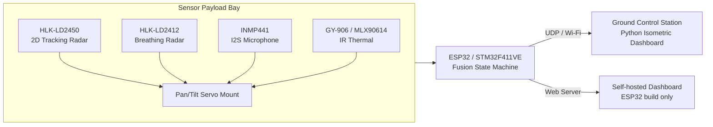

# 🛰️ Project FINDER-Lite

**Autonomous Multi-Modal Search & Rescue Triage System**
*Sensor fusion. Autonomous decision-making. Built to teach how FINDER-class triage actually works — on a hobbyist budget.*

[](#hardware)
[](LICENSE)
[](#roadmap)
[](#)

---

## 🚨 What is this?

NASA JPL's **FINDER** (Finding Individuals for Disaster and Emergency Response) proved that radar-based micro-Doppler sensing can detect a trapped survivor's heartbeat through 30 feet of rubble. That hardware is research-grade and largely inaccessible to small teams, student labs, and resource-constrained rescue units.

**Project FINDER-Lite** is an open, low-cost platform that demonstrates the *decision intelligence* behind FINDER-class triage — autonomous multi-sensor fusion that tells a trapped, breathing survivor apart from a bystander, a fan, or a pile of debris — using hardware anyone can source and build.

> **Honest scope:** this uses close-range 24GHz radar, not through-rubble UWB. It's a line-of-sight triage scanner (think room-clearing, tent searches, vehicle interiors), architected so the fusion logic and protocol are drop-in compatible with a future UWB upgrade for true through-rubble capability. See [Limitations](#-known-limitations) below.

---

## 📖 Table of Contents

- [Features](#-features)
- [System Architecture](#-system-architecture)
- [Hardware](#-hardware)
- [Repository Structure](#-repository-structure)
- [Getting Started](#-getting-started)
- [How the Fusion Logic Works](#-how-the-fusion-logic-works)
- [Known Limitations](#-known-limitations)
- [Roadmap](#-roadmap)
- [Contributing](#-contributing)
- [References & Research](#-references--research)
- [License](#-license)

---

## ✨ Features

- 🎯 **Autonomous target discrimination** — real-time velocity classification separates moving bystanders from stationary/trapped candidates using live radar speed data (no manual tagging)
- 🫁 **Multi-modal confirmation** — breathing-rate lock, motion state, and acoustic corroboration are fused into a single weighted confidence score before anything is declared a survivor
- 🔭 **Autonomous coverage search** — a genuine frontier/nearest-unvisited-cell planner sweeps the environment; nothing is hardcoded or scripted
- 📡 **Self-hosted live dashboard** — the ESP32 build hosts its own Wi-Fi + web UI, no laptop app required
- 🖥️ **Isometric simulation environment** — a full Python fusion-logic simulator with a tactical HUD, live vitals-style waveform monitors, and venue-accurate room modeling, for demoing and validating logic without live hardware risk
- 🔔 **Distress alerting** — independent scream/acoustic-distress detection channel with buzzer notification and approximate location callout
- 🔧 **Portable decision logic** — the same fusion state machine runs (with minimal changes) in Python simulation, on the ESP32, and is designed to port to STM32 C firmware

---

## 🏗️ System Architecture



**Decision pipeline:**
```
SCANNING (autonomous coverage search)
   → DIVERTING (candidate found, slew toward it)
      → HOLDING (10s dwell — poll breathing/acoustic sensors)
         → CONFIRMED  (score ≥ 60/100)
         → REJECTED   (score < 60/100)
   → back to SCANNING
```

---

## 🔩 Hardware

| Component | Role | Notes |
|---|---|---|
| **HLK-LD2450** | 2D spatial tracking radar | 24GHz FMCW, UART @ **256000 baud**, up to 3 simultaneous targets w/ live speed |
| **HLK-LD2412** | Micro-motion / breathing radar | 24GHz FMCW, UART @ 115200 baud, presence + still/moving energy |
| **INMP441** | I2S digital microphone | Acoustic corroboration (tap/shout/scream detection) |
| **GY-906 (MLX90614)** | Non-contact IR thermal sensor | I2C, human-range validation gate |
| **2× hobby servo** | Pan/tilt mount | 30°–150° sweep, points sensors at candidates |
| **ESP32 DevKit V1 (WROOM)** | Standalone tracking node | Direct radar parsing + servo control + self-hosted dashboard |
| **STM32F411VE** | Master controller (full build) | Higher-throughput sensor fusion + servo + relay to ESP32 |
| *(Optional)* S500 + INAV/F722 | Aerial platform | Drone-mounted payload deployment — see [docs](docs/) for T/W and vibration notes |

Full bill-of-materials, wiring diagrams, and pinouts are in [`docs/PROJECT_FINDER_LITE_FULL_CONTEXT.md`](docs/PROJECT_FINDER_LITE_FULL_CONTEXT.md).

---

## 📁 Repository Structure

```
finder-lite/
├── README.md                     ← you are here
├── LICENSE
├── CONTRIBUTING.md
├── .gitignore
├── firmware/
│   └── esp32/
│       └── FinderLite_ESP32.ino  ← standalone ESP32 dual-radar tracker + web dashboard
├── simulation/
│   └── sar_sim.py                ← Python isometric fusion-logic simulator
└── docs/
    ├── PROJECT_FINDER_LITE_FULL_CONTEXT.md         ← full technical spec
    ├── QUICK_REFERENCE_CHECKLIST.md                ← rapid build/debug checklist
    └── PROJECT_FINDER_LITE_HACKATHON_SUBMISSION.md ← problem statement, methodology, references
```

---

## 🚀 Getting Started

### Option A — Run the simulation (no hardware required)
```bash
pip install matplotlib numpy
python simulation/sar_sim.py
```
Watch the autonomous fusion logic run end-to-end against synthetic sensor data — same decision code that runs on real hardware.

### Option B — Flash the ESP32 standalone tracker
1. Install **Arduino IDE** + the **ESP32 board package** (board: `ESP32 Dev Module`)
2. Install the **ESP32Servo** library via Library Manager
3. Wire LD2450 + LD2412 + pan/tilt servos per the pinout table in the sketch header
4. Open `firmware/esp32/FinderLite_ESP32.ino`, flash it
5. Connect to Wi-Fi network `FINDER-LITE` (see sketch for password), browse to `http://192.168.4.1/`

Full setup, wiring, and troubleshooting: [`docs/QUICK_REFERENCE_CHECKLIST.md`](docs/QUICK_REFERENCE_CHECKLIST.md)

---

## 🧠 How the Fusion Logic Works

No single sensor is trusted alone. A target is only confirmed as a survivor after independent evidence agrees:

```
Score = 40 × [breathing rate in 8–30 BPM, clean radar lock]
      + 30 × [quasi-static motion classification]
      + 20 × [acoustic corroboration event detected]
      + 10 × [temporal consistency across full 10s dwell]
──────────────────────────────────────────────────────
CONFIRMED if Score ≥ 60 / 100
```

This mirrors FINDER's own layered clutter-rejection philosophy: motion alone isn't enough (a paused bystander looks the same), breathing alone isn't enough (a fan can spoof simple presence sensors), but the *combination* is very hard to fake.

---

## ⚠️ Known Limitations

| Limitation | Why | Path Forward |
|---|---|---|
| 24GHz radar, not UWB | No rubble/wall penetration | Swap to Novelda/Walabot-class UWB front end |
| Line-of-sight only | Optical-ish radar behavior at 24GHz | Same as above |
| Breathing lock range ~2–5m | Micro-Doppler SNR falls off fast with distance | Antenna gain upgrade, longer dwell |
| Vibration breaks breathing lock | Micro-Doppler is sensitive to platform shake | Vibration-isolated mount for drone deployment |
| Acoustic detection is not localized | Single omnidirectional mic | Add a mic array for phase-based localization |

We'd rather state these clearly than have you discover them mid-demo.

---

## 🗺️ Roadmap

- [ ] Port fusion state machine to native STM32 C firmware
- [ ] MAVLink-fused pan/tilt stabilization for aerial deployment
- [ ] Multi-microphone acoustic localization
- [ ] UWB radar front-end integration (true through-rubble capability)
- [ ] Field validation with a USAR training facility
- [ ] Multi-platform coordinated swarm coverage

---

## 🤝 Contributing

Contributions, issues, and hardware validation reports are welcome — see [`CONTRIBUTING.md`](CONTRIBUTING.md).

This project is explicitly designed to be a **teaching and prototyping platform**. If you build on this — swap in a UWB radar, port the firmware to a different MCU, improve the fusion weighting — please open a PR or share what you learned.

---

## 📚 References & Research

Curated list of the papers and sources that informed this project's design — from FINDER's original research to UWB vital-sign detection and multi-sensor USAR fusion:

- NASA JPL — [FINDER: Target & Propagation Models](https://ntrs.nasa.gov/citations/20150007488)
- NASA — [New Technology Can Detect Heartbeats in Rubble](https://www.jpl.nasa.gov/news/new-technology-can-detect-heartbeats-in-rubble/)
- DHS S&T — [FINDER Fact Sheet](https://www.dhs.gov/archive/science-and-technology/publication/st-finder-fact-sheet-and-video)
- *Presence-Gated VOC Sensing for USAR Applications* — [Scientific Reports](https://www.nature.com/articles/s41598-026-40990-w)
- *A Dataset for Victim Detection Using Robot-Mounted UWB-Radar Sensors* — [Scientific Data](https://www.nature.com/articles/s41597-026-07314-z)
- *A Sensor Review for Human Detection with Robotic Systems* — [SAGE Journals](https://journals.sagepub.com/doi/full/10.1177/17298806231175238)
- *An Exact Coverage Path Planning Algorithm for UAV-Based SAR* — [arXiv](https://arxiv.org/pdf/2405.11399)

Full annotated bibliography: [`docs/PROJECT_FINDER_LITE_HACKATHON_SUBMISSION.md`](docs/PROJECT_FINDER_LITE_HACKATHON_SUBMISSION.md)

---

## 📜 License

Released under the [MIT License](LICENSE) — build on it, fork it, ship it.

---

## 🙏 Acknowledgments

Inspired by NASA JPL and DHS S&T's FINDER program. Built as a hackathon proof-of-concept to make FINDER-class sensor fusion logic understandable and buildable outside a national lab.

*This project is an educational/proof-of-concept platform and is not certified for operational disaster response use.*
